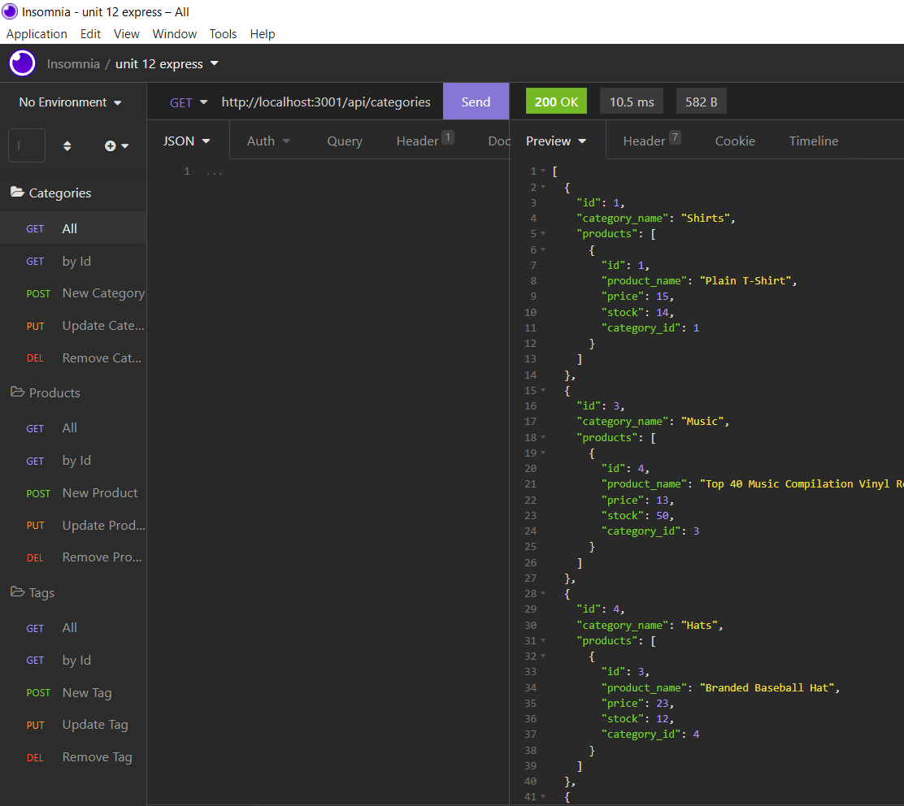

# eCommerce Data Server

## Description
An ecommerence server designed to view, store, update, and remove products. All your products are associated by identifying tags and broard categories so you can easily view products in a category, see which products are associated with which tags, and many other combinations!    

 ## Table of Contents:

  **[How to Use](#how-to-use)**  
  **[Application Demos](#application-demos)**  
  **[Link to Deployed Page](#link-to-deployed-page)**  
  **[References](#references)**  
  **[Devlopment Process](#development-process)**  
  **[Author](#author)**  

## How to Use:
* Download, start your server, and interact using the app Insomnia  
* Enter your server and api route into your insomnia console  
* Choose which CRUD operation you would like to do (includes: get, post, put, delete) and execute

## Application Demos:
  
   
<a href="https://drive.google.com/file/d/1XFHbE2uV49ixkkqU6qa1dCNfnZy4x_B2/view">Video Demo</a>

## Link to Deployed Page:
N/A

## References:
N/A

## Development Process:
1. Created/Imported base files
2. Interpreted/Applied pseudocode and base code from acceptance criteria
3. Tested each aspect of CRUD before moving on to next CRUD or api
4. Worked top down: Category CRUD, then Tag CRUD, and finally Product CRUD
3. See commits for more details

## Author:
Created by Timothy Zalewski | Deployed on [GitHub](https://github.com/Tim-Zebra)